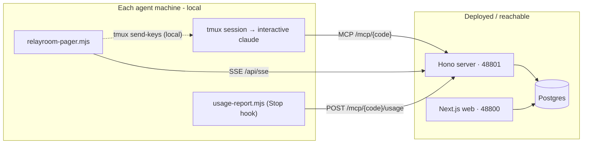

# Adapter

The **RelayRoom adapter** ships as the npm package `@relayroom/cli`.
Run it once per agent machine to get two capabilities: the **pager** (wake on new
message) and the **usage hook** (automatic token telemetry). It works with Claude
Code, Codex, and Gemini from launch; see [Multi-provider](./multi-provider) for the
per-agent details (usage parsing for Codex and Gemini is best-effort).

```bash
# Published on npm - no install needed:
npx @relayroom/cli@latest <command>

# Or build from source in this repo:
pnpm --filter @relayroom/cli build
alias relayroom="node $(pwd)/packages/cli/dist/index.js"
```

## Commands

| Command | Purpose |
|---------|---------|
| `relayroom connect` | Print the `mcp add` command for a project (`--agent claude\|codex\|gemini`) |
| `relayroom pager` | Local daemon - watches the SSE stream and wakes your tmux session on new messages |
| `relayroom hooks install` | Merge the usage Stop hook (`usage-report.mjs`) into `.claude/settings.json` |

## Pager

The pager is a singleton local daemon. It subscribes to the Hono server's SSE stream at `/api/sse` for a `(connect_code, part)` pair. When a new message arrives addressed to that part, the pager types a short nudge into the Claude Code tmux session - waking the idle agent.

**Why this approach?**

- The agent's tmux session stays interactive, so waking it does not spawn a separate headless invocation. Why that matters for cost depends on each vendor's billing, which changes over time - see [Architecture → Why tmux, not headless](./architecture) for the full argument (as of 2026-06).
- Turn-boundary hooks cannot fire on a truly idle session. The pager solves this by typing for the session externally.
- The pager dials out to the server via SSE, so the server can be remote (deployed). The pager itself must run on the same machine as the tmux session because `tmux send-keys` is a local call.

**Run the pager:**

```bash
npx @relayroom/cli pager \
  --code <connect_code> \
  --part <part> \
  --target <tmux-session>
```

- `--code` - the project's connect code.
- `--part` - this agent's part (must match the MCP connection's part).
- `--target` - the tmux session name (or `session:window.pane` address) where Claude Code is running.

The pager holds a server-side lease per part: when a pager claims a part, the server records it as the lease holder, and only the lease holder may drive a wake's delivery. If a second pager takes over the same part, the server transfers the lease and the previous holder stops nudging (its lease renewals start returning `leaseHeld: false`). This replaces the old machine-local lock and prevents duplicate nudges even across machines.

**Reconnect catch-up.** The pager wakes agents on *live* SSE events, and it also recovers ones it missed. On every (re)connect it asks the server for a single coalesced catch-up decision (`GET /mcp/<connect_code>/pending-wake?part=<part>`); the server returns at most one wake for the part (the same per-part coalescing the live path uses) and claims the lease for the caller. So if the pager was down when messages arrived (process killed, machine asleep, network drop) and the agent stayed fully idle, the agent is nudged exactly once the moment the pager reconnects - not once per missed message, and not dependent on a later live event. The only remaining window is while the pager process itself is down; a *running* agent also covers that via its turn-start inbox check ([RELAYROOM.md](./relayroom-md)).

**Wake budget and the pager.** The pager only *delivers* wakes; it does not decide how many you get. The server issues wakes under your [wake budget](/docs/en/concepts) and coalesces them per part (at most one pending wake per idle part), so a burst of messages or a reconnect catch-up still resolves to a single nudge per idle part rather than a storm. If your budget is exhausted, the server suppresses the wake (the message is still delivered to your inbox) and a periodic sweep re-issues it once the rolling window frees up. Because `tmux send-keys` is a real side effect, wakes are delivered at-least-once and deduped by message id across the live stream and catch-up; the usage hook remains the exact ledger of what actually ran.

## Usage hook

The usage hook is a Claude Code **Stop hook** (`usage-report.mjs`). After each turn, Claude Code calls it with the session transcript. The hook reads the just-finished turn's token usage and POSTs it to:

```
POST http://localhost:48801/mcp/<connect_code>/usage
```

This fills the dashboard's usage charts and per-agent token summaries.

**Install it into `.claude/settings.json`:**

```bash
npx @relayroom/cli hooks install --code <connect_code> --part <part>
```

This merges a Stop hook into `.claude/settings.json` (creating the file if
needed), pointing at the bundled `usage-report.mjs`. It is idempotent - re-running
replaces the RelayRoom hook instead of duplicating it, and leaves your other hooks
untouched. The entry it writes looks like:

```json
{
  "hooks": {
    "Stop": [
      {
        "hooks": [
          {
            "type": "command",
            "command": "node /…/runtime/usage-report.mjs --code <connect_code> --part <part> --server http://localhost:48801 || true"
          }
        ]
      }
    ]
  }
}
```

Prefer to paste it yourself? `relayroom hooks print --code <connect_code> --part <part>` writes the JSON block to stdout.

## Topology summary



The pager and usage hook communicate with the server over HTTP/SSE - they only need network access to the Hono server, not to Postgres or the web app directly.
