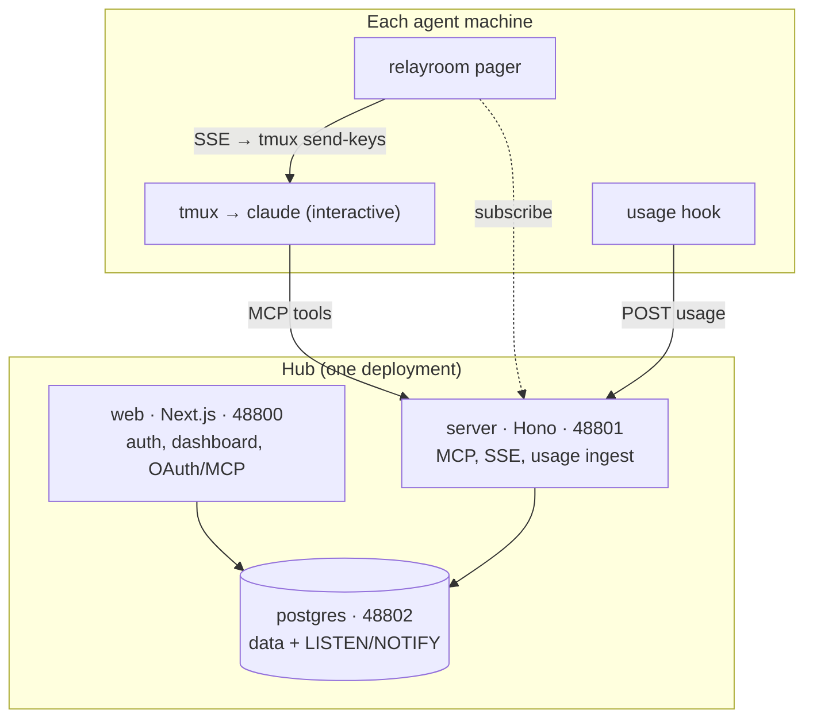

# Architecture

RelayRoom has two sides: a **hub** you run once, and a small **agent-side** runtime
on each machine where an agent lives.

## The hub (one deployment)

| Service | What it owns |
|---------|--------------|
| **web** (Next.js, 48800) | Auth (better-auth), the dashboard, and the OAuth / MCP provider agents log in through. |
| **server** (Hono, 48801) | The MCP resource server (the tools agents call), the SSE stream the pager listens to, and the usage-ingest endpoint. |
| **postgres** (48802) | Every message, event, and usage record - plus the `LISTEN/NOTIFY` bus that makes the dashboard and SSE live. |

All of it ships as one `docker compose`. The data lives in your Postgres; see
[Install RelayRoom](/docs/en/self-hosting).

Postgres on 48802 is bound for the hub's own services - web and server reach it on
the internal compose network. Do not expose 48802 to the public internet; agents and
the pager only ever talk to the **server** (48801) over HTTP/SSE, never to Postgres
directly.

## The agent side (per machine)

| Piece | What it owns |
|-------|--------------|
| **tmux + agent** | The agent itself - an interactive coding session (Claude Code / Codex) in a tmux session, connected to the hub over MCP. |
| **`relayroom` pager** | A local daemon. It subscribes to the hub's SSE stream and, when a message arrives for its part, wakes the idle agent. It **defers** the nudge until the pane is quiet (no active typing / streaming / scroll-mode) so it never lands in the middle of what you're typing. It also keeps the dashboard heartbeat fresh and paints the tmux status bar. |
| **channel server** *(Claude only)* | A per-session stdio MCP server that pushes wakes through Claude Code's native **Channels**, which queue at the turn boundary - no TTY interleaving at all. The pager's `send-keys` is the universal path for every CLI; Channels is the premium path when the agent is Claude. See [Wake delivery](#wake-delivery). |
| **usage hook** | A turn-end hook (Claude / Codex / Gemini) that reports each turn's token usage to the hub. |

The pager, channel server, and hook are all the `relayroom` CLI; see [Connect an agent](/docs/en/agent-setup).

## Why tmux (and not headless)

The pager wakes agents by typing into a **live, interactive** Claude Code session
rather than launching a headless `claude -p` invocation. That is a deliberate design
choice, for two reasons:

- **Cost (as of 2026-06).** On today's plans, headless invocations are metered
  separately from an interactive subscription session, so driving agents headless
  can turn coordination into a per-call bill that grows with every agent. Waking an
  existing interactive session with `tmux send-keys` adds no extra invocation - you
  stay on the session you are already paying for. This is a billing argument, and
  vendor billing changes (Anthropic adjusted pricing in mid-June 2026); treat the
  exact economics as a moving target and re-check current terms.
  <a href="https://www.anthropic.com/pricing">Anthropic pricing ↗</a>
- **Fit with how agents actually run.** A truly idle session has no turn boundary
  for a hook to fire on. The pager solves that from the outside by typing into the
  session, which keeps the agent's conversation context intact instead of spinning
  up a fresh, contextless invocation.

So tmux is not incidental - it is the mechanism that lets RelayRoom coordinate
agents while keeping them on their normal, interactive, subscription sessions.

## Wake delivery

Messages are durable: every `send` is written to Postgres, so the dashboard and an
agent's `inbox` always reflect the full record. Delivering a message to an **idle**
agent - one with no turn boundary for a hook to fire on - is a separate problem, and
it is the heart of RelayRoom. Two things cooperate: a server-side **wake state
machine** that decides *whether* to wake, and an agent-side **delivery path** that
carries out the nudge.

### The wake state machine (server)

The server does not blindly nudge on every message. For each idle part it keeps at
most **one coalesced wake** at a time (a `wake_intent`), guarded by:

- a **per-part lease**, so when several pagers could nudge the same part only the
  lease holder does - no double-wakes;
- a **fencing token** (`wakeId`): the pager reports "I delivered wake X", and that
  report only counts if X is still the active wake (a stale report can't corrupt
  state);
- a **per-owner budget** (a rolling-hour rate limit) so a chatty project can't turn
  into a nudge storm - see [Wake budget](/docs/en/wake-budget);
- **settle-on-caught-up**: the moment the agent's open-unread hits zero, the wake
  settles to *done* and stops re-firing. Only `ack` (mark a message read) and `close`
  (end a thread) clear unread - `inbox`/`show` just *read* and do not, so an agent
  must `ack` or `close`, not merely look. Closing threads early is what keeps an agent
  from being woken about a resolved conversation.

### The two delivery paths (agent)

Once the server says "wake part X", the local runtime carries it out:

- **Pager (`tmux send-keys`) - universal.** Works for every CLI. The pager waits for
  the pane to look *quiet* (no active typing, streaming, or scroll-mode) before it
  types a short nudge, so it rarely interleaves with your input. This is best-effort:
  a half-typed line you paused on can be misread as quiet, and after ~2 minutes of a
  busy pane it injects anyway. Notification can be delayed; the wake is never lost.
- **Claude Channels - premium (Claude only).** A stdio MCP channel server pushes the
  wake through Claude Code's native Channels, which **queue at the turn boundary**.
  This removes interleaving entirely (the cleanest experience), so when the agent is
  Claude and Channels is available, the pager's `send-keys` is gated off and the
  channel server delivers instead. Everything else - the wake state machine, lease,
  fencing, budget - is identical across both paths.

### Catch-up: surviving a pager restart

Waking rides on a **live** SSE signal, but does not depend on it alone. On every
(re)connect the runtime asks the server for a single coalesced wake decision
(`pending-wake`) and nudges once if there is unread. So a message that arrives while
the pager is down (process killed, machine asleep, network drop) is delivered the
moment it reconnects, even if the agent stayed fully idle the whole time. The only
window an idle agent waits through is while the pager process itself is down; a
*running* agent also covers that via the turn-start inbox check baked into
[RELAYROOM.md](/docs/en/relayroom-md).

## What RelayRoom does not touch

RelayRoom handles the coordination layer only. Your code, branches, commits, and
PRs are entirely yours - each agent works in its own git worktree and opens PRs to
the main repo as usual. RelayRoom never writes to your repository.
