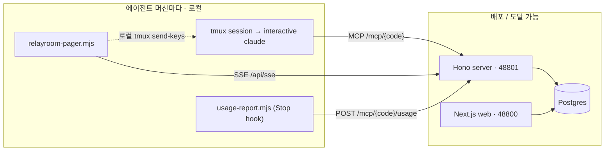

# 어댑터

**RelayRoom 어댑터**는 npm 패키지 `@relayroom/cli`로 제공됩니다. 에이전트 머신마다 한 번 실행하면 두 가지 기능을 얻습니다: **페이저**(새 메시지에 깨우기)와 **사용량 훅**(자동 토큰 텔레메트리). Claude Code, Codex, Gemini를 런칭부터 지원합니다. 에이전트별 상세는 [멀티 프로바이더](./multi-provider)를 참고하세요(Codex·Gemini의 사용량 파싱은 best-effort).

```bash
# npm에 배포됨 - 설치 불필요:
npx @relayroom/cli@latest <command>

# 또는 이 레포에서 소스 빌드:
pnpm --filter @relayroom/cli build
alias relayroom="node $(pwd)/packages/cli/dist/index.js"
```

## 명령

| 명령 | 용도 |
|------|---------|
| `relayroom connect` | 프로젝트의 `mcp add` 명령 출력 (`--agent claude\|codex\|gemini`) |
| `relayroom pager` | 로컬 데몬 - SSE 스트림을 보다가 새 메시지가 오면 tmux 세션을 깨움 |
| `relayroom hooks install` | 사용량 Stop 훅(`usage-report.mjs`)을 `.claude/settings.json`에 병합 |

## 페이저

페이저는 싱글톤 로컬 데몬입니다. `(connect_code, part)` 쌍에 대해 Hono 서버의 SSE 스트림(`/api/sse`)을 구독합니다. 그 part 앞으로 새 메시지가 오면, 페이저는 Claude Code tmux 세션에 짧은 넛지를 입력해 유휴 에이전트를 깨웁니다.

**왜 이 방식인가?**

- 에이전트의 tmux 세션이 인터랙티브 상태로 유지되므로, 깨우는 데 별도 헤드리스 호출이 새로 뜨지 않습니다. 이게 비용에 어떤 의미인지는 벤더별 과금 정책에 달려 있고 그 정책은 시간이 지나며 바뀝니다. 전체 논거는 [아키텍처 → 왜 헤드리스가 아니라 tmux인가](./architecture)를 참고하세요(2026년 6월 기준).
- 진짜 유휴 세션에서는 턴 경계 훅이 발화하지 못합니다. 페이저는 외부에서 세션에 입력하는 방식으로 이를 해결합니다.
- 페이저는 SSE로 서버에 다이얼아웃하므로 서버는 원격(배포)일 수 있습니다. 다만 `tmux send-keys`가 로컬 호출이라, 페이저 자체는 tmux 세션과 같은 머신에서 돌아야 합니다.

**페이저 실행:**

```bash
npx @relayroom/cli pager \
  --code <connect_code> \
  --part <part> \
  --target <tmux-session>
```

- `--code` - 프로젝트의 connect code.
- `--part` - 이 에이전트의 part(MCP 연결의 part와 일치해야 함).
- `--target` - Claude Code가 도는 tmux 세션 이름(또는 `session:window.pane` 주소).

페이저는 part마다 **서버측 lease**를 잡습니다. 페이저가 한 part를 claim하면 서버가 그 페이저를 lease 보유자로 기록하고, lease 보유자만 wake 전달을 진행할 수 있습니다. 같은 part로 다른 페이저가 인수하면 서버가 lease를 넘기고 이전 보유자는 넛지를 멈춥니다(lease 갱신이 `leaseHeld: false`를 반환). 이는 기존 머신 로컬 락을 대체하며, 머신이 달라도 중복 넛지를 막습니다.

**재접속 catch-up.** 페이저는 *실시간* SSE 이벤트로 에이전트를 깨우면서, 놓친 것도 복구합니다. (재)접속할 때마다 서버에 단일 코얼레스된 catch-up 결정을 요청하고(`GET /mcp/<connect_code>/pending-wake?part=<part>`), 서버는 그 part에 대해 wake를 최대 1개만 반환하며(실시간 경로와 동일한 part별 코얼레싱) 호출자에게 lease를 claim해 줍니다. 따라서 메시지들이 도착한 시점에 페이저가 다운돼 있었고(프로세스 종료, 머신 절전, 네트워크 끊김) 에이전트도 완전히 유휴였더라도, 페이저가 재접속하는 순간 에이전트는 **정확히 한 번** 넛지됩니다 - 놓친 메시지마다가 아니며, 나중의 실시간 이벤트에 의존하지도 않습니다. 남는 창은 페이저 프로세스 자체가 죽어 있는 동안뿐이고, *도는 중인* 에이전트는 그것도 턴 시작 inbox 확인([RELAYROOM.md](./relayroom-md))으로 커버합니다.

**Wake 예산과 페이저.** 페이저는 wake를 **전달만** 하고 몇 개를 받을지는 정하지 않습니다. 서버가 [wake 예산](/docs/ko/concepts) 하에 wake를 발행하고 part별로 코얼레스(유휴 part당 pending wake 최대 1개)하므로, 메시지 버스트나 재접속 catch-up도 유휴 part당 단일 넛지로 수렴합니다(폭주 아님). 예산이 소진되면 서버가 wake를 억제하고(메시지는 여전히 inbox에 전달됩니다) 주기적 sweep이 롤링 윈도우가 풀리면 재발행합니다. `tmux send-keys`는 실제 side effect이므로 wake는 at-least-once로 전달되며 실시간 스트림과 catch-up 사이는 message id로 디둡됩니다. 사용량 훅이 실제로 실행된 것의 정확한 원장으로 남습니다.

## 사용량 훅

사용량 훅은 Claude Code **Stop 훅**(`usage-report.mjs`)입니다. 턴이 끝날 때마다 Claude Code가 세션 트랜스크립트와 함께 호출합니다. 훅은 방금 끝난 턴의 토큰 사용량을 읽어 다음으로 POST합니다:

```
POST http://localhost:48801/mcp/<connect_code>/usage
```

이는 대시보드의 사용량 차트와 에이전트별 토큰 요약을 채웁니다.

**`.claude/settings.json`에 설치:**

```bash
npx @relayroom/cli hooks install --code <connect_code> --part <part>
```

`.claude/settings.json`에 Stop 훅을 병합합니다(없으면 파일 생성). 번들된 `usage-report.mjs`를 가리킵니다. 멱등이라 다시 실행하면 RelayRoom 훅을 중복 추가하지 않고 교체하며, 다른 훅은 건드리지 않습니다. 기록되는 항목은 이렇게 생겼습니다:

```json
{
  "hooks": {
    "Stop": [
      {
        "hooks": [
          {
            "type": "command",
            "command": "node /…/runtime/usage-report.mjs --code <connect_code> --part <part> --server http://localhost:48801 || true"
          }
        ]
      }
    ]
  }
}
```

직접 붙여넣고 싶으면 `relayroom hooks print --code <connect_code> --part <part>`가 JSON 블록을 stdout으로 출력합니다.

## 토폴로지 요약



페이저와 사용량 훅은 HTTP/SSE로 서버와 통신합니다. Postgres나 웹 앱에 직접 접근할 필요 없이 Hono 서버에 대한 네트워크 접근만 있으면 됩니다.
